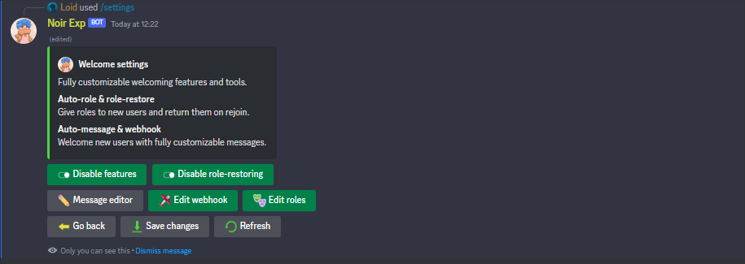

Welcome new users in the best way.

Key features

- Custom welcome messages
- Auto-role
- Role restoring

## What are welcome messages

Welcome messages are messages that are sent when a new user joins your server. They are fully customizable. Setup welcome channel and use our powerful message editor to create your own welcome message.

:::tip

Use custom variables to provide additional information about the user or the server.

:::

## What is auto-role

Auto-role is a feature that gives a role to a new user when they join your server. Do not limit yourself, give up to 5 roles at once.

## What is role restoring

Tired of giving back roles when user left and joined back ?. Role restoring will automatically save user's roles and give it back when they rejoin.
